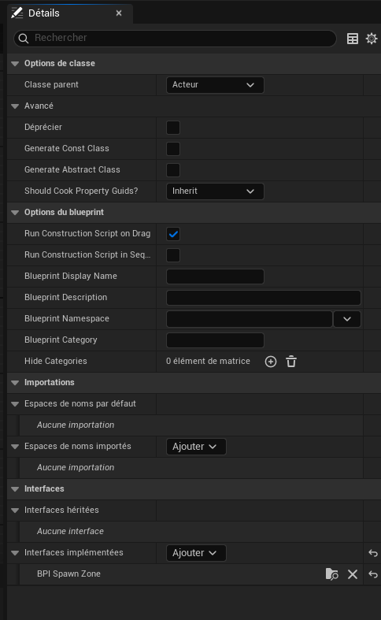

---
layout:
  title:
    visible: true
  description:
    visible: false
  tableOfContents:
    visible: true
  outline:
    visible: true
  pagination:
    visible: true
---

# BP\_SpawnZone

### Paramètres de classe

<figure><figcaption><p>BP_SpawnZone - Paramètres de classe</p></figcaption></figure>

### Valeurs par défaut de classe

<figure><figcaption><p>BP_SpawnZone - Valeurs par défaut de classe pt1</p></figcaption></figure>

<figure><figcaption><p>BP_SpawnZone - Valeurs par défaut de classe pt2</p></figcaption></figure>

<figure><figcaption><p>BP_SpawnZone - Valeurs par défaut de classe pt3</p></figcaption></figure>

<figure><figcaption><p>BP_SpawnZone - Valeurs par défaut de classe pt4</p></figcaption></figure>

### Graphiques

#### EventGraph

```
Begin Object Class=/Script/BlueprintGraph.K2Node_Event Name="K2Node_Event_0" ExportPath="/Script/BlueprintGraph.K2Node_Event'/Game/Blueprints/BP_SpawnZone.BP_SpawnZone:EventGraph.K2Node_Event_0'"
   EventReference=(MemberParent="/Script/CoreUObject.Class'/Script/Engine.Actor'",MemberName="ReceiveBeginPlay")
   bOverrideFunction=True
   EnabledState=Disabled
   bCommentBubblePinned=True
   bCommentBubbleVisible=True
   NodeComment="Ce nœud est désactivé et ne sera pas appelé.\nFaites glisser les broches pour générer des fonctionnalités."
   NodeGuid=ED6CCDEC4385D22E721F889464245ED8
   CustomProperties Pin (PinId=F73007BC41D67158EF1EA9993E0FAA11,PinName="OutputDelegate",Direction="EGPD_Output",PinType.PinCategory="delegate",PinType.PinSubCategory="",PinType.PinSubCategoryObject=None,PinType.PinSubCategoryMemberReference=(MemberParent="/Script/CoreUObject.Class'/Script/Engine.Actor'",MemberName="ReceiveBeginPlay"),PinType.PinValueType=(),PinType.ContainerType=None,PinType.bIsReference=False,PinType.bIsConst=False,PinType.bIsWeakPointer=False,PinType.bIsUObjectWrapper=False,PinType.bSerializeAsSinglePrecisionFloat=False,PersistentGuid=00000000000000000000000000000000,bHidden=False,bNotConnectable=False,bDefaultValueIsReadOnly=False,bDefaultValueIsIgnored=False,bAdvancedView=False,bOrphanedPin=False,)
   CustomProperties Pin (PinId=17F539A94DEA195F4CA62BB74C157DAC,PinName="then",Direction="EGPD_Output",PinType.PinCategory="exec",PinType.PinSubCategory="",PinType.PinSubCategoryObject=None,PinType.PinSubCategoryMemberReference=(),PinType.PinValueType=(),PinType.ContainerType=None,PinType.bIsReference=False,PinType.bIsConst=False,PinType.bIsWeakPointer=False,PinType.bIsUObjectWrapper=False,PinType.bSerializeAsSinglePrecisionFloat=False,PersistentGuid=00000000000000000000000000000000,bHidden=False,bNotConnectable=False,bDefaultValueIsReadOnly=False,bDefaultValueIsIgnored=False,bAdvancedView=False,bOrphanedPin=False,)
End Object
Begin Object Class=/Script/BlueprintGraph.K2Node_Event Name="K2Node_Event_1" ExportPath="/Script/BlueprintGraph.K2Node_Event'/Game/Blueprints/BP_SpawnZone.BP_SpawnZone:EventGraph.K2Node_Event_1'"
   EventReference=(MemberParent="/Script/CoreUObject.Class'/Script/Engine.Actor'",MemberName="ReceiveActorBeginOverlap")
   bOverrideFunction=True
   NodePosY=208
   EnabledState=Disabled
   bCommentBubblePinned=True
   bCommentBubbleVisible=True
   NodeComment="Ce nœud est désactivé et ne sera pas appelé.\nFaites glisser les broches pour générer des fonctionnalités."
   NodeGuid=2211C61D430D46C92C436F86F30BAD14
   CustomProperties Pin (PinId=1E8E1DC040DC74A23CA695889BABCDCF,PinName="OutputDelegate",Direction="EGPD_Output",PinType.PinCategory="delegate",PinType.PinSubCategory="",PinType.PinSubCategoryObject=None,PinType.PinSubCategoryMemberReference=(MemberParent="/Script/CoreUObject.Class'/Script/Engine.Actor'",MemberName="ReceiveActorBeginOverlap"),PinType.PinValueType=(),PinType.ContainerType=None,PinType.bIsReference=False,PinType.bIsConst=False,PinType.bIsWeakPointer=False,PinType.bIsUObjectWrapper=False,PinType.bSerializeAsSinglePrecisionFloat=False,PersistentGuid=00000000000000000000000000000000,bHidden=False,bNotConnectable=False,bDefaultValueIsReadOnly=False,bDefaultValueIsIgnored=False,bAdvancedView=False,bOrphanedPin=False,)
   CustomProperties Pin (PinId=C20345314C6199B4015CD493D94BB106,PinName="then",Direction="EGPD_Output",PinType.PinCategory="exec",PinType.PinSubCategory="",PinType.PinSubCategoryObject=None,PinType.PinSubCategoryMemberReference=(),PinType.PinValueType=(),PinType.ContainerType=None,PinType.bIsReference=False,PinType.bIsConst=False,PinType.bIsWeakPointer=False,PinType.bIsUObjectWrapper=False,PinType.bSerializeAsSinglePrecisionFloat=False,PersistentGuid=00000000000000000000000000000000,bHidden=False,bNotConnectable=False,bDefaultValueIsReadOnly=False,bDefaultValueIsIgnored=False,bAdvancedView=False,bOrphanedPin=False,)
   CustomProperties Pin (PinId=EEEE5D2D46F7BE9D424EF39AEF6683FB,PinName="OtherActor",PinToolTip="Other Actor\nActeur Référence d\'objet",Direction="EGPD_Output",PinType.PinCategory="object",PinType.PinSubCategory="",PinType.PinSubCategoryObject="/Script/CoreUObject.Class'/Script/Engine.Actor'",PinType.PinSubCategoryMemberReference=(),PinType.PinValueType=(),PinType.ContainerType=None,PinType.bIsReference=False,PinType.bIsConst=False,PinType.bIsWeakPointer=False,PinType.bIsUObjectWrapper=False,PinType.bSerializeAsSinglePrecisionFloat=False,PersistentGuid=00000000000000000000000000000000,bHidden=False,bNotConnectable=False,bDefaultValueIsReadOnly=False,bDefaultValueIsIgnored=False,bAdvancedView=False,bOrphanedPin=False,)
End Object
Begin Object Class=/Script/BlueprintGraph.K2Node_Event Name="K2Node_Event_2" ExportPath="/Script/BlueprintGraph.K2Node_Event'/Game/Blueprints/BP_SpawnZone.BP_SpawnZone:EventGraph.K2Node_Event_2'"
   EventReference=(MemberParent="/Script/CoreUObject.Class'/Script/Engine.Actor'",MemberName="ReceiveTick")
   bOverrideFunction=True
   NodePosY=416
   EnabledState=Disabled
   bCommentBubblePinned=True
   bCommentBubbleVisible=True
   NodeComment="Ce nœud est désactivé et ne sera pas appelé.\nFaites glisser les broches pour générer des fonctionnalités."
   NodeGuid=FE1A37A941DF4FE702C9859253332860
   CustomProperties Pin (PinId=4CC751C54D6EE254457261B1044E6664,PinName="OutputDelegate",Direction="EGPD_Output",PinType.PinCategory="delegate",PinType.PinSubCategory="",PinType.PinSubCategoryObject=None,PinType.PinSubCategoryMemberReference=(MemberParent="/Script/CoreUObject.Class'/Script/Engine.Actor'",MemberName="ReceiveTick"),PinType.PinValueType=(),PinType.ContainerType=None,PinType.bIsReference=False,PinType.bIsConst=False,PinType.bIsWeakPointer=False,PinType.bIsUObjectWrapper=False,PinType.bSerializeAsSinglePrecisionFloat=False,PersistentGuid=00000000000000000000000000000000,bHidden=False,bNotConnectable=False,bDefaultValueIsReadOnly=False,bDefaultValueIsIgnored=False,bAdvancedView=False,bOrphanedPin=False,)
   CustomProperties Pin (PinId=468648D44F645B583CF5198230ADA4A9,PinName="then",Direction="EGPD_Output",PinType.PinCategory="exec",PinType.PinSubCategory="",PinType.PinSubCategoryObject=None,PinType.PinSubCategoryMemberReference=(),PinType.PinValueType=(),PinType.ContainerType=None,PinType.bIsReference=False,PinType.bIsConst=False,PinType.bIsWeakPointer=False,PinType.bIsUObjectWrapper=False,PinType.bSerializeAsSinglePrecisionFloat=False,PersistentGuid=00000000000000000000000000000000,bHidden=False,bNotConnectable=False,bDefaultValueIsReadOnly=False,bDefaultValueIsIgnored=False,bAdvancedView=False,bOrphanedPin=False,)
   CustomProperties Pin (PinId=3AF45CD549163AA3AECF71B34F6ED972,PinName="DeltaSeconds",PinToolTip="Delta Seconds\nFloat (simple précision)",Direction="EGPD_Output",PinType.PinCategory="real",PinType.PinSubCategory="float",PinType.PinSubCategoryObject=None,PinType.PinSubCategoryMemberReference=(),PinType.PinValueType=(),PinType.ContainerType=None,PinType.bIsReference=False,PinType.bIsConst=False,PinType.bIsWeakPointer=False,PinType.bIsUObjectWrapper=False,PinType.bSerializeAsSinglePrecisionFloat=False,DefaultValue="0.0",AutogeneratedDefaultValue="0.0",PersistentGuid=00000000000000000000000000000000,bHidden=False,bNotConnectable=False,bDefaultValueIsReadOnly=False,bDefaultValueIsIgnored=False,bAdvancedView=False,bOrphanedPin=False,)
End Object

```

### Fonctions

#### Construction Script

```
Begin Object Class=/Script/BlueprintGraph.K2Node_FunctionEntry Name="K2Node_FunctionEntry_0" ExportPath="/Script/BlueprintGraph.K2Node_FunctionEntry'/Game/Blueprints/BP_SpawnZone.BP_SpawnZone:UserConstructionScript.K2Node_FunctionEntry_0'"
   FunctionReference=(MemberParent="/Script/CoreUObject.Class'/Script/Engine.Actor'",MemberName="UserConstructionScript")
   NodeGuid=02CAB43B4192F7259AA3EE8779581BEE
   CustomProperties Pin (PinId=3AFB107A415A97D5173C18BB518022EE,PinName="then",Direction="EGPD_Output",PinType.PinCategory="exec",PinType.PinSubCategory="",PinType.PinSubCategoryObject=None,PinType.PinSubCategoryMemberReference=(),PinType.PinValueType=(),PinType.ContainerType=None,PinType.bIsReference=False,PinType.bIsConst=False,PinType.bIsWeakPointer=False,PinType.bIsUObjectWrapper=False,PinType.bSerializeAsSinglePrecisionFloat=False,PersistentGuid=00000000000000000000000000000000,bHidden=False,bNotConnectable=False,bDefaultValueIsReadOnly=False,bDefaultValueIsIgnored=False,bAdvancedView=False,bOrphanedPin=False,)
End Object

```

#### GetRandomPointInZone

```
{
  "Function": "GetRandomPointInZone",
  "Access": "Public",
  "Pure": false,
  "Category": "Par défaut",
  "Inputs": [],
  "Outputs": [
    {
      "Name": "Vector",
      "Type": "Vector"
    }
  ],
  "Logic": [
    "Get Variable: Box (BoxComponent)",
    "BoxComponent::GetScaledBoxExtent → Box Extent (Vector)",
    "SceneComponent::K2_GetComponentLocation → Box Location (Vector)",
    "BreakVector(Box Extent) → X, Y, Z",
    "Multiply X, Y, Z by -1 → Negative Extents",
    "RandomFloatInRange(X Min, X Max), Y, Z",
    "MakeVector(X, Y, Z)",
    "Add(MakeVector, Box Location)",
    "Return Vector"
  ]
}

```

#### StartSpawnLoop

```
{
  "Function": {
    "Name": "IsZoneAvailable",
    "Type": "Pure",
    "AccessSpecifier": "Public",
    "Category": "Par défaut",
    "Output": {
      "Name": "IsAvailable",
      "Type": "bool",
      "DefaultValue": true
    },
    "Logic": [
      {
        "Get": "SpawnedActorsInZone",
        "Type": "Array<Actor>"
      },
      {
        "CallFunction": "Array_Length",
        "Input": "SpawnedActorsInZone",
        "Output": "NumSpawnedActors"
      },
      {
        "Get": "MaxActorsInZone",
        "Type": "int"
      },
      {
        "Operation": "Less",
        "Inputs": ["NumSpawnedActors", "MaxActorsInZone"],
        "Output": "IsUnderMax"
      },
      {
        "Get": "bIsZoneEnabled",
        "Type": "bool"
      },
      {
        "Get": "bCooldownOver",
        "Type": "bool"
      },
      {
        "Operation": "BooleanAND",
        "Inputs": ["IsUnderMax", "bIsZoneEnabled", "bCooldownOver"],
        "Output": "IsAvailable"
      }
    ]
  }
}

```

### Variables

#### DefaultSceneRoot

<div align="center"><figure><figcaption><p>DefaultSceneRoot</p></figcaption></figure></div>

#### SpawnZones

<figure><figcaption><p>SpawnZones</p></figcaption></figure>

```
BPVar(VarName="SpawnZones",VarGuid=99BB1E3747AAB611B223A3B7E2262CCD,VarType=(PinCategory="object",PinSubCategory="",PinSubCategoryObject="/Script/Engine.BlueprintGeneratedClass'/Game/Blueprints/BP_SpawnZone.BP_SpawnZone_C'",PinSubCategoryMemberReference=(MemberParent=None,MemberName="",MemberGuid=00000000000000000000000000000000),PinValueType=(TerminalCategory="",TerminalSubCategory="",TerminalSubCategoryObject=None,bTerminalIsConst=False,bTerminalIsWeakPointer=False,bTerminalIsUObjectWrapper=False),ContainerType=Array,bIsReference=False,bIsConst=False,bIsWeakPointer=False,bIsUObjectWrapper=False,bSerializeAsSinglePrecisionFloat=False),FriendlyName="Spawn Zones",Category=NSLOCTEXT("KismetSchema", "Default", "Default"),PropertyFlags=2053,RepNotifyFunc="",ReplicationCondition=COND_None,MetaDataArray=((DataKey="ExposeOnSpawn",DataValue="true")),DefaultValue="")
```

#### MaxSpawnedActors

<figure><figcaption><p>MaxSpawnedActors</p></figcaption></figure>

```
BPVar(VarName="MaxSpawnedActors",VarGuid=E2377D9143074317B09A1F854859A5BE,VarType=(PinCategory="int",PinSubCategory="",PinSubCategoryObject=None,PinSubCategoryMemberReference=(MemberParent=None,MemberName="",MemberGuid=00000000000000000000000000000000),PinValueType=(TerminalCategory="",TerminalSubCategory="",TerminalSubCategoryObject=None,bTerminalIsConst=False,bTerminalIsWeakPointer=False,bTerminalIsUObjectWrapper=False),ContainerType=None,bIsReference=False,bIsConst=False,bIsWeakPointer=False,bIsUObjectWrapper=False,bSerializeAsSinglePrecisionFloat=False),FriendlyName="Max Spawned Actors",Category=NSLOCTEXT("KismetSchema", "Default", "Default"),PropertyFlags=5,RepNotifyFunc="",ReplicationCondition=COND_None,MetaDataArray=,DefaultValue="0")
```

#### SpawnedActors

<figure><figcaption><p>SpawnedActors</p></figcaption></figure>

```
BPVar(VarName="SpawnedActors",VarGuid=F49BAD44426F82AECBC9F4B02F29BF14,VarType=(PinCategory="object",PinSubCategory="",PinSubCategoryObject="/Script/CoreUObject.Class'/Script/Engine.Actor'",PinSubCategoryMemberReference=(MemberParent=None,MemberName="",MemberGuid=00000000000000000000000000000000),PinValueType=(TerminalCategory="",TerminalSubCategory="",TerminalSubCategoryObject=None,bTerminalIsConst=False,bTerminalIsWeakPointer=False,bTerminalIsUObjectWrapper=False),ContainerType=Array,bIsReference=False,bIsConst=False,bIsWeakPointer=False,bIsUObjectWrapper=False,bSerializeAsSinglePrecisionFloat=False),FriendlyName="Spawned Actors",Category=NSLOCTEXT("KismetSchema", "Default", "Default"),PropertyFlags=67589,RepNotifyFunc="",ReplicationCondition=COND_None,MetaDataArray=,DefaultValue="")
```

#### SpawnInterval

<figure><figcaption><p>SpawnInterval</p></figcaption></figure>

```
BPVar(VarName="SpawnInterval",VarGuid=6A910B7846BC5E1FB72427A4F4F53902,VarType=(PinCategory="real",PinSubCategory="double",PinSubCategoryObject=None,PinSubCategoryMemberReference=(MemberParent=None,MemberName="",MemberGuid=00000000000000000000000000000000),PinValueType=(TerminalCategory="",TerminalSubCategory="",TerminalSubCategoryObject=None,bTerminalIsConst=False,bTerminalIsWeakPointer=False,bTerminalIsUObjectWrapper=False),ContainerType=None,bIsReference=False,bIsConst=False,bIsWeakPointer=False,bIsUObjectWrapper=False,bSerializeAsSinglePrecisionFloat=False),FriendlyName="Spawn Interval",Category=NSLOCTEXT("KismetSchema", "Default", "Default"),PropertyFlags=5,RepNotifyFunc="",ReplicationCondition=COND_None,MetaDataArray=,DefaultValue="0.000000")
```

#### ActorToSpawn

<figure><figcaption><p>ActorToSpawn</p></figcaption></figure>

```
BPVar(VarName="ActorToSpawn",VarGuid=1181DFF84F0A322C19672598988B6F54,VarType=(PinCategory="class",PinSubCategory="",PinSubCategoryObject="/Script/CoreUObject.Class'/Script/Engine.Actor'",PinSubCategoryMemberReference=(MemberParent=None,MemberName="",MemberGuid=00000000000000000000000000000000),PinValueType=(TerminalCategory="",TerminalSubCategory="",TerminalSubCategoryObject=None,bTerminalIsConst=False,bTerminalIsWeakPointer=False,bTerminalIsUObjectWrapper=False),ContainerType=None,bIsReference=False,bIsConst=False,bIsWeakPointer=False,bIsUObjectWrapper=False,bSerializeAsSinglePrecisionFloat=False),FriendlyName="Actor to Spawn",Category=NSLOCTEXT("KismetSchema", "Default", "Default"),PropertyFlags=5,RepNotifyFunc="",ReplicationCondition=COND_None,MetaDataArray=,DefaultValue="None")
```

#### bUsePooling

<figure><figcaption><p>bUsePooling</p></figcaption></figure>

```
BPVar(VarName="bUsePooling",VarGuid=9084CD3B449C3222CDE389BA35CDEECB,VarType=(PinCategory="bool",PinSubCategory="",PinSubCategoryObject=None,PinSubCategoryMemberReference=(MemberParent=None,MemberName="",MemberGuid=00000000000000000000000000000000),PinValueType=(TerminalCategory="",TerminalSubCategory="",TerminalSubCategoryObject=None,bTerminalIsConst=False,bTerminalIsWeakPointer=False,bTerminalIsUObjectWrapper=False),ContainerType=None,bIsReference=False,bIsConst=False,bIsWeakPointer=False,bIsUObjectWrapper=False,bSerializeAsSinglePrecisionFloat=False),FriendlyName="Use Pooling",Category=NSLOCTEXT("KismetSchema", "Default", "Default"),PropertyFlags=5,RepNotifyFunc="",ReplicationCondition=COND_None,MetaDataArray=,DefaultValue="False")
```

#### ActorPool

<figure><figcaption><p>ActorPool</p></figcaption></figure>

```
BPVar(VarName="ActorPool",VarGuid=EB5307D144D10BAC2C19248F485B3AC0,VarType=(PinCategory="object",PinSubCategory="",PinSubCategoryObject="/Script/CoreUObject.Class'/Script/Engine.Actor'",PinSubCategoryMemberReference=(MemberParent=None,MemberName="",MemberGuid=00000000000000000000000000000000),PinValueType=(TerminalCategory="",TerminalSubCategory="",TerminalSubCategoryObject=None,bTerminalIsConst=False,bTerminalIsWeakPointer=False,bTerminalIsUObjectWrapper=False),ContainerType=Array,bIsReference=False,bIsConst=False,bIsWeakPointer=False,bIsUObjectWrapper=False,bSerializeAsSinglePrecisionFloat=False),FriendlyName="Actor Pool",Category=NSLOCTEXT("KismetSchema", "Default", "Default"),PropertyFlags=67589,RepNotifyFunc="",ReplicationCondition=COND_None,MetaDataArray=,DefaultValue="")
```

####

####

####

####

####

####

####
